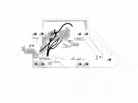

# S-ROV #
<br>
>Rov didático para o ensino básico



## Índice ##
* [Introdução](#introdução)
* [Lista das pastas](#lista-das-pastas)
* [Status](#status)

#### Introdução ####
#### Lista das pastas ####

* 🗀 3D
```
Ficheiros stl/obj para impressão 3d das peças do S-ROV
```
* 🗀 atividades
```
Ficheiros PDF das atividades a desenvolver
```

* 🗀 img
```
Ficheiros de imagens das peças do S-ROV
```
#### Status ####
Em desenvolvimento